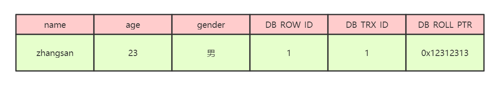
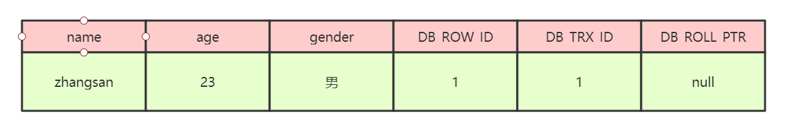
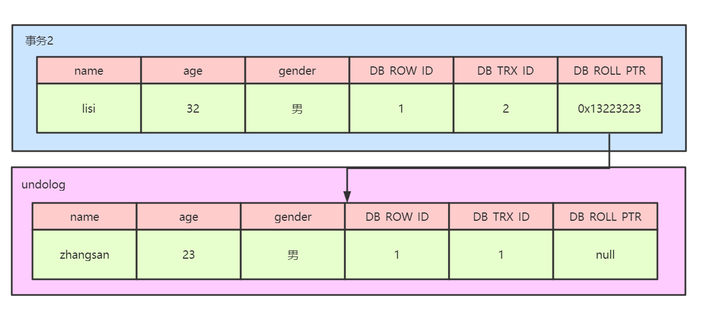
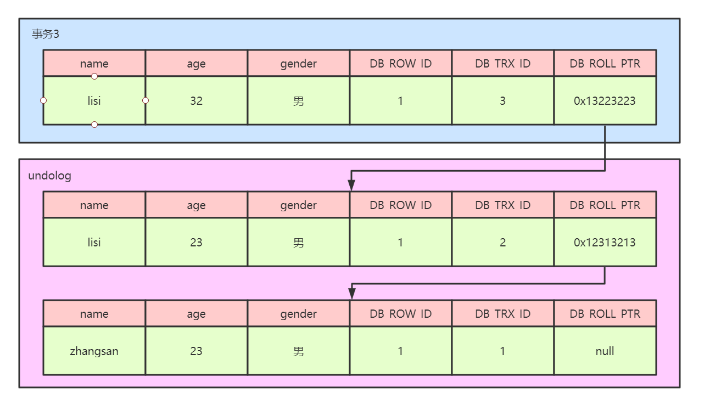

# MVCC多版本并发控制

### 1、MVCC

​        MVCC，全称Multi-Version Concurrency Control，即多版本并发控制。MVCC是一种并发控制的方法，一般在数据库管理系统中，实现对数据库的并发访问，在编程语言中实现事务内存。

         MVCC在MySQL InnoDB中的实现主要是为了提高数据库并发性能，用更好的方式去处理读写冲突，做到即使有读写冲突时，也能做到不加锁，非阻塞并发读。

### 2、当前读

​        像select lock in share mode(共享锁), select for update ; update, insert ,delete(排他锁)这些操作都是一种当前读，为什么叫当前读？就是它读取的是记录的最新版本，读取时还要保证其他并发事务不能修改当前记录，会对读取的记录进行加锁。

### 3、快照读（提高数据库的并发查询能力）

​        像不加锁的select操作就是快照读，即不加锁的非阻塞读；快照读的前提是隔离级别不是串行级别，串行级别下的快照读会退化成当前读；之所以出现快照读的情况，是基于提高并发性能的考虑，快照读的实现是基于多版本并发控制，即MVCC,可以认为MVCC是行锁的一个变种，但它在很多情况下，避免了加锁操作，降低了开销；既然是基于多版本，即快照读可能读到的并不一定是数据的最新版本，而有可能是之前的历史版本

### 4、当前读、快照读、MVCC关系

​        MVCC多版本并发控制指的是维持一个数据的多个版本，使得读写操作没有冲突，快照读是MySQL为实现MVCC的一个非阻塞读功能。MVCC模块在MySQL中的具体实现是由三个隐式字段，undo日志、read view三个组件来实现的。

### 5、MVCC解决的问题

​        数据库并发场景有三种，分别为：

​        1、读读：不存在任何问题，也不需要并发控制

​        2、读写：有线程安全问题，可能会造成事务隔离性问题，可能遇到脏读、幻读、不可重复读

​        3、写写：有线程安全问题，可能存在更新丢失问题

​        MVCC是一种用来解决读写冲突的无锁并发控制，也就是为事务分配单项增长的时间戳，为每个修改保存一个版本，版本与事务时间戳关联，读操作只读该事务开始前的数据库的快照，所以MVCC可以为数据库解决一下问题：

​        1、在并发读写数据库时，可以做到在读操作时不用阻塞写操作，写操作也不用阻塞读操作，提高了数据库并发读写的性能

​        2、解决脏读、幻读、不可重复读等事务隔离问题，但是不能解决更新丢失问题

### 6、MVCC实现原理

​        mvcc的实现原理主要依赖于记录中的三个隐藏字段，undolog，read view来实现的。

​        **隐藏字段**

​        每行记录除了我们自定义的字段外，还有数据库隐式定义的DB_TRX_ID,DB_ROLL_PTR,DB_ROW_ID等字段

​        DB_TRX_ID

​        6字节，最近修改事务id，记录创建这条记录或者最后一次修改该记录的事务id

​        DB_ROLL_PTR

​        7字节，回滚指针，指向这条记录的上一个版本,用于配合undolog，指向上一个旧版本

​        DB_ROW_JD

​        6字节，隐藏的主键，如果数据表没有主键，那么innodb会自动生成一个6字节的row_id

​        记录如图所示：



​        在上图中，DB_ROW_ID是数据库默认为该行记录生成的唯一隐式主键，DB_TRX_ID是当前操作该记录的事务ID，DB_ROLL_PTR是一个回滚指针，用于配合undo日志，指向上一个旧版本

​        **undo log**

​        undolog被称之为回滚日志，表示在进行insert，delete，update操作的时候产生的方便回滚的日志

​        当进行insert操作的时候，产生的undolog只在事务回滚的时候需要，并且在事务提交之后可以被立刻丢弃

​        当进行update和delete操作的时候，产生的undolog不仅仅在事务回滚的时候需要，在快照读的时候也需要，所以不能随便删除，只有在快照读或事务回滚不涉及该日志时，对应的日志才会被purge线程统一清除（当数据发生更新和删除操作的时候都只是设置一下老记录的deleted_bit，并不是真正的将过时的记录删除，因为为了节省磁盘空间，innodb有专门的purge线程来清除deleted_bit为true的记录，如果某个记录的deleted_id为true，并且DB_TRX_ID相对于purge线程的read view 可见，那么这条记录一定时可以被清除的）

​        **下面我们来看一下undolog生成的记录链**

​        1、假设有一个事务编号为1的事务向表中插入一条记录，那么此时行数据的状态为：



​        2、假设有第二个事务编号为2对该记录的name做出修改，改为lisi

​        在事务2修改该行记录数据时，数据库会对该行加排他锁

​        然后把该行数据拷贝到undolog中，作为 旧记录，即在undolog中有当前行的拷贝副本

​        拷贝完毕后，修改该行name为lisi，并且修改隐藏字段的事务id为当前事务2的id，回滚指针指向拷贝到undolog的副本记录中

​        事务提交后，释放锁



​        3、假设有第三个事务编号为3对该记录的age做了修改，改为32

​        在事务3修改该行数据的时，数据库会对该行加排他锁

​        然后把该行数据拷贝到undolog中，作为旧纪录，发现该行记录已经有undolog了，那么最新的旧数据作为链表的表头，插在该行记录的undolog最前面

​        修改该行age为32岁，并且修改隐藏字段的事务id为当前事务3的id，回滚指针指向刚刚拷贝的undolog的副本记录

​        事务提交，释放锁



​        从上述的一系列图中，大家可以发现，不同事务或者相同事务的对同一记录的修改，会导致该记录的undolog生成一条记录版本线性表，即链表，undolog的链首就是最新的旧记录，链尾就是最早的旧记录。

​        **Read View**

​        上面的流程如果看明白了，那么大家需要再深入理解下read view的概念了。

​        Read View是事务进行快照读操作的时候生产的读视图，在该事务执行快照读的那一刻，会生成一个数据系统当前的快照，记录并维护系统当前活跃事务的id，事务的id值是递增的。

​        其实Read View的最大作用是用来做可见性判断的，也就是说当某个事务在执行快照读的时候，对该记录创建一个Read View的视图，把它当作条件去判断当前事务能够看到哪个版本的数据，有可能读取到的是最新的数据，也有可能读取的是当前行记录的undolog中某个版本的数据

​        Read View遵循的可见性算法主要是将要被修改的数据的最新记录中的DB_TRX_ID（当前事务id）取出来，与系统当前其他活跃事务的id去对比，如果DB_TRX_ID跟Read View的属性做了比较，不符合可见性，那么就通过DB_ROLL_PTR回滚指针去取出undolog中的DB_TRX_ID做比较，即遍历链表中的DB_TRX_ID，直到找到满足条件的DB_TRX_ID,这个DB_TRX_ID所在的旧记录就是当前事务能看到的最新老版本数据。

​        Read View的可见性规则如下所示：

​        首先要知道Read View中的四个全局属性：

- m_ids：生成readview的时候，当前系统中所有活跃的事务id的集合
- min_trx_id：m_ids中最小的事务id，代表当前最早未提交的事务

- max_trx_id：表示系统尚未分配的下一个事务id值

- creator_trx_id：生成该readview的事务id

​        具体的比较规则如下：

​		1、如果版本的DB_TRX_ID==creator_trx_id，表示该版本是当前事务自己修改的，可读

​		2、如果版本的DB_TRX_ID&#x3c;min_trx_id,代表该版本的事务已经提交，可读

​		3、如果版本的DB_TRX_ID>=max_trx_id,代表该版本的事务在当前readview生成后才启动，不可读

​		4、如果min_trx_id&#x3c;=DB_TRX_ID&#x3c;max_trx_id，此时需要判断DB_TRX_ID是否在m_ids中，如果在则代表事务没有提交，不可读，如果没有在则代表事务已经提交，可读

​		若当前的版本不可读，则通过DB_ROLL_PTR指针找到上一个历史版本状态，重复判断的操作，直到找到可读数据为止，如果没有可读数据，那么则为空

### 7、RC、RR级别下的InnoDB快照读有什么不同

​        因为Read View生成时机的不同，从而造成RC、RR级别下快照读的结果的不同

​        1、在RR级别下的某个事务的对某条记录的第一次快照读会创建一个快照即Read View,将当前系统活跃的其他事务记录起来，此后在调用快照读的时候，还是使用的是同一个Read View,所以只要当前事务在其他事务提交更新之前使用过快照读，那么之后的快照读使用的都是同一个Read View,所以对之后的修改不可见

​        2、在RR级别下，快照读生成Read View时，Read View会记录此时所有其他活动和事务的快照，这些事务的修改对于当前事务都是不可见的，而早于Read View创建的事务所做的修改均是可见

​        3、在RC级别下，事务中，每次快照读都会新生成一个快照和Read View,这就是我们在RC级别下的事务中可以看到别的事务提交的更新的原因。

​        **总结：在RC隔离级别下，是每个快照读都会生成并获取最新的Read View,而在RR隔离级别下，则是同一个事务中的第一个快照读才会创建Read View，之后的快照读获取的都是同一个Read View.**

### 8、mysql8.0跟5.7版本之间的区别

1、事务id的生成机制

在mysql5.7中，事务ID是全局递增的4字节整数，存在事务ID溢出的风险

在mysql8.0中，会引入事务id生成器，不再是简单的递增，而是结合epoch（纪元，64位）和counter（计数器，32位）生成，格式位（epoch<<32|counter）

2、隐藏字段的微调

DB_TRX_ID，从4字节扩展为8字节

3、undolog

5.7中undolog默认存储在系统表空间，8.0使用独立的undolog表空间，避免系统表空间膨胀

5.7中的purge线程是单线程处理，8.0是并行purge

4、readview的改进

8.0取消了trx_list列表，改用事务状态跟踪和范围判断，用高水位和低水位来替代列表

readview中不再记录所有活跃事务id，而是通过两个关键值跟踪活跃事务范围：

low_limit_id:当前所有活跃事务中最小的id

up_limit_id:下一个将要分配的事务id

可见性算法判断改为：

对于版本链中某行的`trx_id`，8.0 的判断逻辑简化为：

1. 若`trx_id < low_limit_id`：修改该版本的事务已提交（在当前 Read View 生成前提交），可见；

2. 若`trx_id >= high_limit_id`：修改该版本的事务在当前 Read View 生成后启动，不可见；

3. 若

   ```
   low_limit_id <= trx_id < high_limit_id
   ```

   ：通过事务的 “提交状态” 判断（InnoDB 维护事务的提交记录，直接查询该事务是否已提交）：

   - 已提交：可见；
   - 未提交：不可见。

这种方式避免了遍历`m_ids`列表，大幅提升了高并发下的可见性判断效率。

5、readview的持久化和复用

8.0 的 Read View 会被持久化到内存中（而非每次生成时临时构建），且多个事务可共享相同的 Read View（当活跃事务范围不变时），减少内存占用和生成开销。